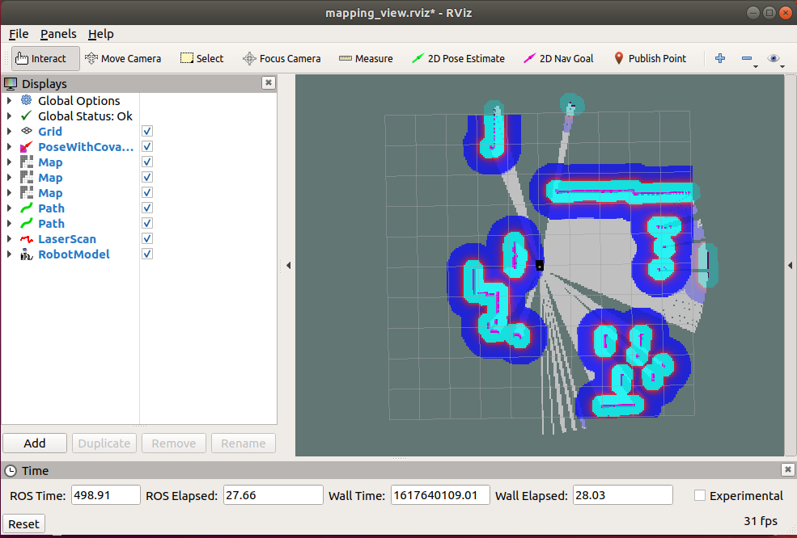

## Indoor Robot URDF model

This repository containes a [ROS](https://www.ros.org/) application intended to enable getting started with indoor robotic simulation quickly. The application contains a configurable [URDF](https://wiki.ros.org/urdf) model of an indoor robot, packaged in [ROS package](http://wiki.ros.org/ROS/Tutorials/CreatingPackage) format to be used in [Gazebo](http://gazebosim.org/) Simulator.

The application uses ROS packages from the [navigation stack](http://wiki.ros.org/navigation) to setup the robot to be fully capable of operating in the [small-house](https://github.com/aws-robotics/aws-robomaker-small-house-world) Gazebo world. 

## Instructions for getting started on Ubuntu 18.04 machine, with [ROS Melodic](http://wiki.ros.org/melodic).

### With [Catkin](https://docs.ros.org/en/api/catkin/html/)
```
git clone https://github.com/aws-samples/indoor-robot-urdf
cd indoor-robot-urdf/workspace
rosws update
rosdep install --from-path src --ignore-src -r -y
catkin_make
source devel/setup.bash
roslaunch robot_gazebo gazebo.launch 
```

### With [Colcon](https://colcon.readthedocs.io/en/released/user/quick-start.html#build-ros-1-packages)
```
git clone https://github.com/aws-samples/indoor-robot-urdf
cd indoor-robot-urdf/workspace
rosws update
rosdep install --from-path src --ignore-src -r -y
colcon build
source install/setup.bash
roslaunch robot_gazebo gazebo.launch 
```

You will be viewing the robot in a Gazebo environment as below:


To Launch mapping sample application, open a new terminal with the program running, and launch the mapping rospacakges with

```
roslaunch robot_navigation gmapping_demo.launch
```

You will be viewing the robot running the mapping process, with a view from rviz as below:


## URDF

The configurable URDF of the robot is present [here](workspace/src/robot_description/urdf/) in the repository and can be viewed separately in rviz by running the command

```
roslaunch robot_description robot_view.launch
```
**Note:** Kill all ros processes before you run this command, since it launches the description ros-package which is also present in the gmapping demo. 

The Rviz view looks as following


## Security

See [CONTRIBUTING](CONTRIBUTING.md#security-issue-notifications) for more information.

## License

This library is licensed under the MIT-0 License. See the LICENSE file.

